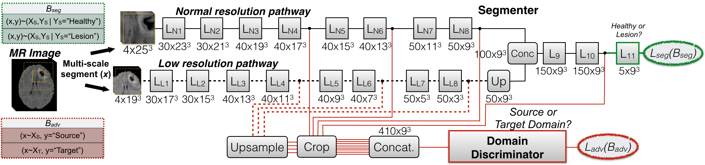

Unsupervised domain adaptation in brain lesion segmentation with adversarial networks
=====================================================

Oral presentation of our work: [Kamnitsas et al, Unsupervised domain adaptation in brain lesion segmentation with adversarial networks, IPMI 2017](https://link.springer.com/chapter/10.1007/978-3-319-59050-9_47)

Presented in the conference: [Information Processing in Medical Imaging 2017, Boone, USA](http://www.ipmi2017.org/)

Runner up for the Francois Erbsmann Prize.

Figure: DeepMedic with an adversarial domain discriminator for unsupervised domain adaptation.

## Further use of this material

I hope you find this material useful. If you do and use any of it in further works or presentations, please mention our paper as its original source, or this github if no paper is associated with the particular material/figure.

Thank you,
Konstantinos Kamnitsas